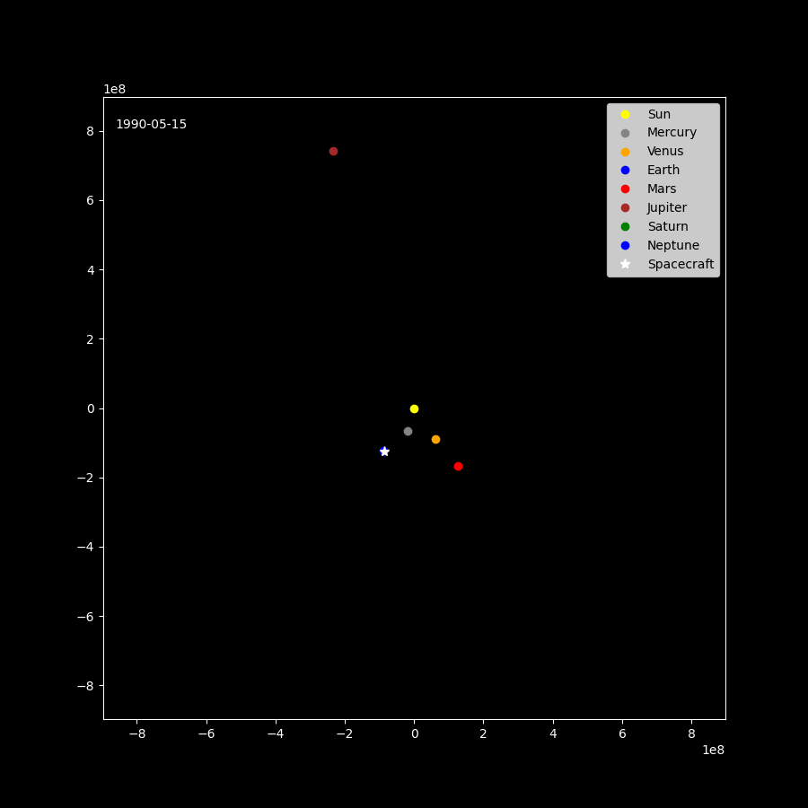

<p align="center">
  <br>
  <em>Example Earth -> Venus -> Earth -> Jupiter candidate (ΔV ≈ 9 km s<sup>-1</sup>)</em>
</p>

---

# ✈️ Multi-Gravity-Assist Trajectory Optimiser  
_A compact, reproducible implementation of Wagner & Wie (2015)_

[](#)
[](#)
[](#)

This repository re-creates the **“Hybrid Algorithm for Multiple
Gravity-Assist and Impulsive ΔV Manoeuvres”**  
published by **Wagner & Wie, JGCD 2015** and extends it with:

* ⚡ **Hermite-spline ephemeris cache** – one-time SPICE read, then
  500 000 state queries / s.
* 🧬 **Genetic Algorithm + LBFGS/NLP hybrid** – global search followed by
  local polishing of continuous genes.
* 🛰️ Built-in 2-D matplotlib animation & autoplay GIF export.
* 🔧 All hyper-parameters, planet catalogues & bounds in a single YAML
  file (`configs/…`).


---

Quick start 🚀

```bash
git clone https://github.com/<you>/trajectory-optimization.git
cd trajectory-optimization
python -m venv .venv && source .venv/bin/activate
pip install -r requirements.txt

# 1) generate a 5-yr ephemeris cache (≈ 3 s, 1.5 MB)
python -m mga_opt precompute-ephemeris configs/parameters.yaml

# 2) run the hybrid GA + NLP search
python -m mga_opt search configs/parameters.yaml

# 3) play or export the best trajectory
python -m mga_opt plot outputs/best_YYYYMMDD_HHMMSS.json     
python - <<'PY'
from mga_opt.plotting import animate
animate("outputs/best_*.json", save_gif="demo/eej.gif")
PY
